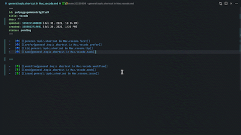

## Info

> NOTICE: File must belong to the vault configured in [settings](#settings).

Reveal current active file in [Obsidian](https://obsidian.md/) vault.

## Settings

> NOTICE: You have to provide the vault name that you want to open later.

Vault name can be configured by following steps

1. go to plugin settings 
2. fill in the vault name

## Usage

-   use the command palette execute the command `obsidian code: open file with obsidian`
-   use the default shortcut `cmd+alt+o`

## Thanks

-   [Huyz](https://github.com/huyz)
